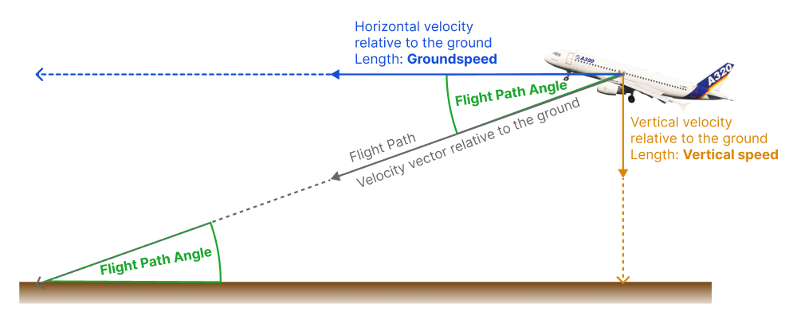

# Cold Temperature Altitude Correction Calculator

Calculates the cold temperature correction for altitudes measured using a barometric altimeter. The correction is based upon the elevation of the aerodrome and temperature measured at the aerodrome on the ground.

**The calculator is available online at:<br>
[➡ https://fvalka.github.io/flight-cold-temperature-correction/](https://fvalka.github.io/flight-cold-temperature-correction/)**
___ 
THE SOFTWARE IS PROVIDED "AS IS", WITHOUT WARRANTY OF ANY KIND, EXPRESS OR IMPLIED, INCLUDING BUT NOT LIMITED TO THE WARRANTIES OF MERCHANTABILITY, FITNESS FOR A PARTICULAR PURPOSE AND NONINFRINGEMENT. IN NO EVENT SHALL THE AUTHORS BE LIABLE FOR ANY CLAIM, DAMAGES OR OTHER LIABILITY, WHETHER IN AN ACTION OF CONTRACT, TORT OR OTHERWISE, ARISING FROM, OUT OF OR IN CONNECTION WITH THE SOFTWARE OR THE USE OR OTHER DEALINGS IN THE SOFTWARE.

THIS SOFTWARE IS NOT CERTIFIED OR APPROVED FOR ANY OPERATIONAL USE!
USE PURELY AT YOUR OWN RISK!
___

## Introduction

### Cold Temperature Corrections

> _"In winter the mountaints are higher"_

Of course the mountains are not actually higher in winter but the barometric altimeters used in aviation are calibrated to the ISA standard atmostpheric conditions and assume a standard sea level temperature of $15 °C$ with the 
temperature decreasing with increasing altitude at a rate of $-0.0019812 \frac{°C}{ft}$. 

When the temperature is colder than the standard ISA temperature the barometric altimeter in the plane will show an altitude which is higher than the actual altitude. 


### Flight Path Angle

The Flight Path Angle is the angle between the horizontal (ground) and the velocity vector relative to the ground.

The velocity vector relative to the ground can be split up into two components: <br>
Horizontal (parallel) to the ground with it’s length being the: Groundspeed <br>
Vertical (perpendicular) to the ground with it’s length being the: Vertical speed



Drawing just the lengths of the vectors as a triangle we get:


Therefore we can calculate the Flight Path Angle from the Vertical Speed and Ground Speed using the arctan (inverse of the tangent function) making sure that we first convert them to the same units
```math
    \tan\left({\text{Flight Path Angle}}\right) = \frac{\text{Vertical speed}}{\text{Ground speed}}
    \implies  {\text{Flight Path Angle}} = \arctan \left( \frac{\text{Vertical speed}}{\text{Ground speed}} \right)
```

For example with a Groundspeed of 100 kt and a Vertical speed of 500 ft/min we get after conversion to SI units:

```math
    \text{Flight Path Angle} = 
    \arctan \left( \frac{500 \mathrm{\frac{ft}{min}}}{100 \mathrm{kt}} \right) 
    = 
    \arctan \left( \frac{2.54 \mathrm{\frac{m}{s}}}{51.44 \mathrm{\frac{m}{s}}} \right)    
    \approx 2.8^{\circ}
```

Which is also where the rule of thumb comes from that for descending on a 3° glide path you take the ground speed * 5 or ground speed * 10/2 since when we calculate the vertical speed for 1 kt of groundspeed we get:

```math
    \tan(3^{\circ}) \cdot 1\; \mathrm{kt} \approx 0.05241\; \mathrm{kt} \approx 5.3\; \mathrm{\frac{ft}{min}}
```

#### Cold Temperature Corrections

When flight path angle is determined based on the change in barometric altitude or barometric vertical speed it will also be subject to altimetry errors caused by the 
off-standard temperature of the atmosphere. 


Therefore we can see that after correction the approach path seems steeper based on the instrumentation of the aircraft while the actual approach path is now following the intended flight path angle. 


## Calculation Methods

### Inputs

As inputs we use:
- the aerodrome elevation, $h_{Aerodrome}$, in ft.
- the temperature on the ground at the aerodrome, $T_{Aerodrome}$, in $°C$
- the altitude (above MSL) which we want to correct, $z_{Airplane}$, in $ft$
- the flight path angle which we want to correct, $\gamma_{Approach}$, in $°$
- the climb gradient which want to correct, $\bar{\gamma}_{Climb}$, in $%$

### ISA Deviation 

Using these inputs we first calculate the aerodrome ISA temperature deviation, $\Delta T_{std}$, in $°C$ using the following paramters of the standard atmosphere:
- the ISA standard lapse rate, $L_0$ of $-0.0019812 \frac{°C}{ft}$
- the sea level ISA standard temperature, $T_0$, of $15 °C$

```math
T_{ISA}(h_{Aerodrome}) = T_0 + L_0 h_{Aerodrome} 
```

```math
\Delta T_{std} = T_{Aerodrome} - T_{ISA}(h_{Aerodrome})
```


### Altitude Correction Equation using the "Accurate corrections" Equation in ICAO Doc 8168 Volume III

The Eurocontrol Guidelines and ICAO Doc 8168 cites this equations as Equation 24 of the Engineering Sciences Data Unit (ESDU) publication: Performance, Volume 2, Item Number 77022. 

The uncorrected height of the aircraft above the aerodrome is obtained by subtracting the aerodrome elevation from the uncorrected input altitude. 

where we then use the following physical quanitites in the calculation of the height correction $\Delta h_{correction}$ in $ft$:
- aerodrome ISA temperature deviation, $\Delta T_{std}$, in $°C$
- the ISA standard lapse rate, $L_0$ of $-0.0019812 \frac{°C}{ft}$
- the uncorrected height of the aircraft above the aerodrome elevation, $\Delta hP_{Airplane}$ in $ft$
- the sea level ISA standard temperature, $T_0$, of $288.15 K$

```math
\Delta h_{correction} = \frac{-\Delta T_{std}}{L_0} \ln \left( 1 + \frac{L_0 \Delta hP_{Airplane}}{T_0 + L_0 hP_{Aerodrome}} \right)
```
#### MathJS Implementation toTex

Using the [mathjs](https://mathjs.org/) evaluation parser we can compare the actual equation in the actual program code used to the equation described above:

```math
\left(\frac{- DeltaTstd}{ L0}\right)\cdot\ln\left(1+\frac{\left( L0\cdot hPAirplane\right)}{\left( T0+ L0\cdot hPAerodrome\right)}\right)
```

### Flight Path Angle Correction

Based on the explanations of the flight path angle a correction equation can also be derived. 

First we take the uncorrected altitude at the Final Approach Fix/Final Descent point, $h_{FAF,uncorrected}$ 
and calculate the corrected altitude at the FAF/FDP, $h_{FAF,corrected}$, using the equation described above.

```math
\gamma_{corrected} = \arctan \left( \tan(\gamma_{uncorrected}) \frac{h_{FAF,corrected}}{h_{FAF,uncorrected}} \right)
```

#### MathJS Implementation toTex

Using the [mathjs](https://mathjs.org/) evaluation parser we can compare the actual equation in the actual program code used to the equation described above:

```math
\tan^{-1}\left(\frac{\tan\left( gammaUncorrected\right)\cdot hCorrected}{ hUncorrected}\right)
```

### Climb Gradient Correction

The climb gradient is corrected by converting the climb gradient into a flight path angle using the equation:

```math
\gamma_{Climb} = \arctan \left( \frac{\gamma'_{Climb}}{100} \right)
```

This flight path angle is then corrected as described for the flight path angle and converted back into a gradient using 

```math
\gamma_{Climb,corrected} = \tan \left( \gamma'_{Climb,corrected} \right) \cdot 100
```

### Assumptions

- The ISA difference is negative, meaning only temperatures colder than ISA are allowed
- The temperature gradient of the atmosphere follows the ISA gradient of $-0.0019812 \frac{°C}{ft}$
- The calculations are for altitudes lower than the ISA tropopause of $36 000 ft$

## Validation / Debugging of the Calculations

### Crossverification against two other implementations

Unit test examples were generated using two other implementations done by myself but in R and once using the ESDU equation described above 
and also using an alternative equation, these were also used to generate some test points for the unit tests:
[/doc/validation-implementation/temperature-correction.R](https://github.com/fvalka/flight-cold-temperature-correction/blob/21d2b78d73f30d150f2859dae0b474c6bad3b37b/doc/validation-implementation/temperature-correction.R)

### Manual generation of unit test examples

Unit test examples were manually created based on a third equation from the [Transport Canada AC 500-200, section 4.8 "Acccurate Method"](https://tc.canada.ca/en/aviation/reference-centre/advisory-circulars/advisory-circular-ac-no-500-020#toc4-8)

Further manual examples were created for unit tests of the flight path angle calculation. 

### Equations and Calculation Parmaters on the Dev Console 

All the equations used and their input parameters are logged to the console on debug level. 

To verify or debug the calculations open the dev console, set the console log levels to "Verbose" and then look for the folliwng messages:


## References
1. [EUROCONTROL Guidelines for Cold Temperature Corrections by ATS, 2014](https://www.eurocontrol.int/publication/eurocontrol-guidelines-cold-temperature-corrections-ats)
2. ICAO Doc 8168 Procedures for Air Navigation Services - Aircraft Operations - Volume III - Aircraft Operating Procedures, First Edition, 2018
3. [Flight Management System (FMS) Barometric Vertical Navigation (VNAV) Temperature Compensation, Advisory Circular (AC) No. 500-020, Transport Candada, 2025](https://tc.canada.ca/en/aviation/reference-centre/advisory-circulars/advisory-circular-ac-no-500-020#toc4-8)
4. Diston, D. J. Computational Modellingand Simulation of Aircraftand the Environment. in Computational Modelling and Simulation of Aircraft and the Environment, Volume 1 (John Wiley & Sons, Incorporated, United Kingdom, 2009).


